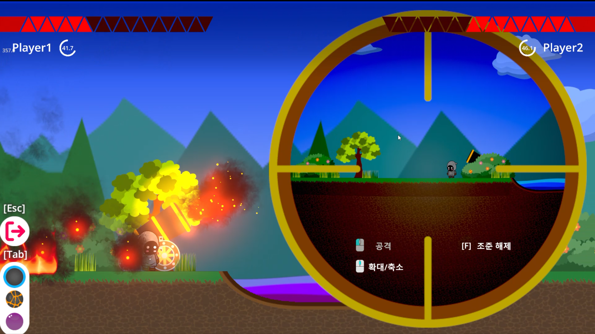
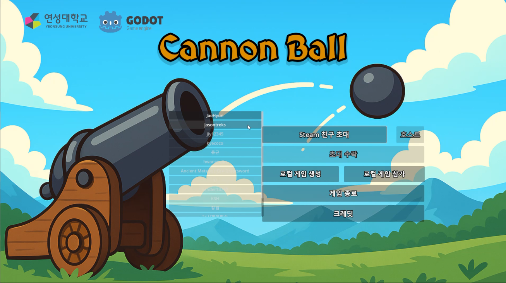
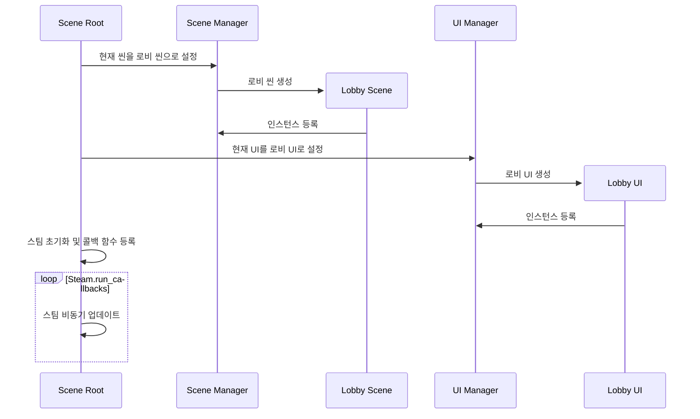
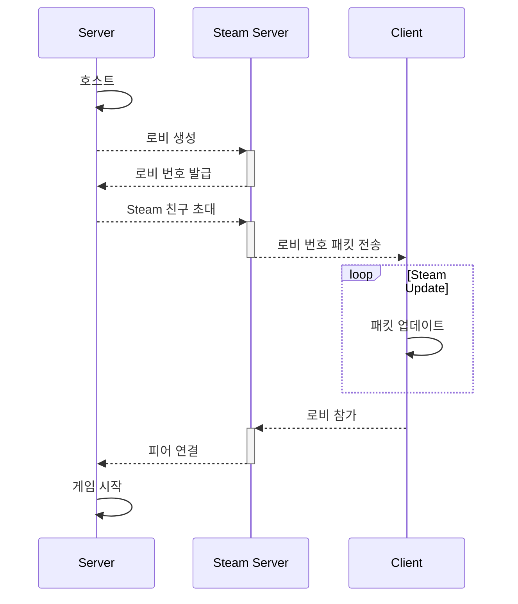
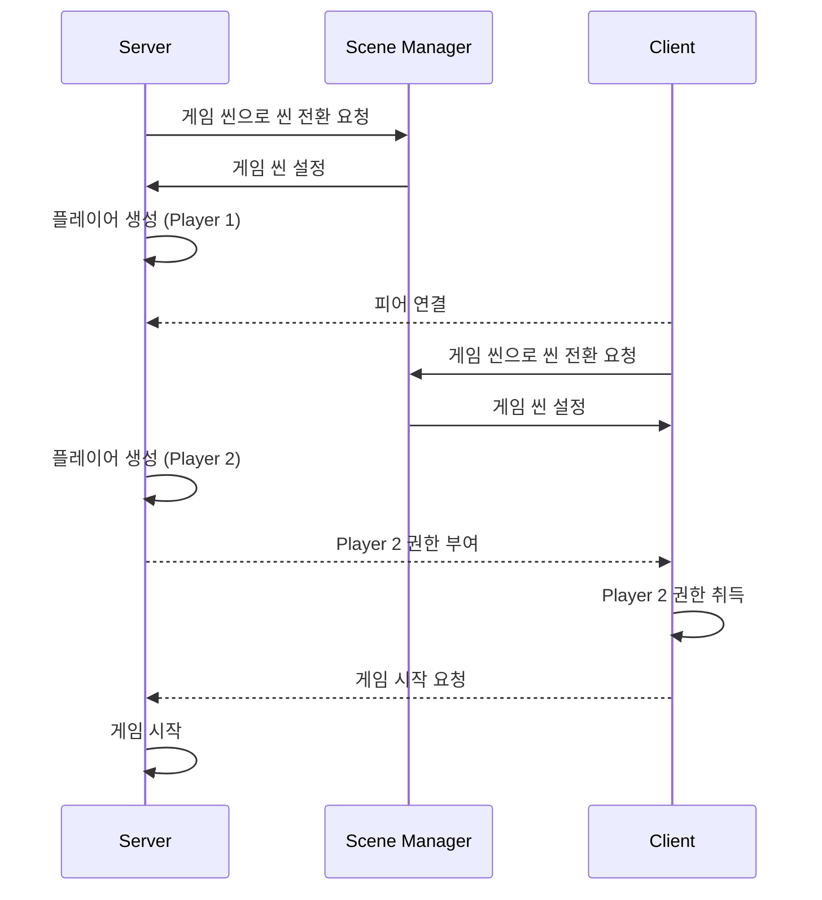

# CannonBall
##  목차
- [개요](#개요)
- [테스트 방법](#테스트-방법)
- [시퀀스 다이어그램](#시퀀스-다이어그램)
****
## 개요

- **게임 소개:** 대포와 세 종류의 탄환을 이용하여 전투를 벌이는 2D 턴제 슈팅 게임
- **팀 소개:** 연성대학교 컴퓨터 소프트웨어과 '본때' 동아리 소속 5인
- **팀 구성:** 팀장 1, 프로그래밍 2, 그래픽 및 UI 2
- **개발 환경:** Windows11, [Godot Engine 4.4.1](https://godotengine.org)
- **개발 언어:** GDScript, glsl3.0(쉐이더)
- **버전 관리:** Github
- **기타 사용 툴:** Adobe Illustrator(에셋 제작)

****

## 테스트 방법

#### 스팀 멀티플레이 테스트
1. 스팀 클리아이언트 실행 및 로그인
2. **CannonBall/CannonBallExe/CannonBall.exe** 실행
3. 호스트: 'Steam 친구 초대' 버튼 클릭 -> 함께 테스트하는 사람 스팀 친구 선택 -> '호스트' 버튼 클릭(게임이 로드되고 초대가 전송됨)
4. 참가자: 초대를 받으면 '초대 수락' 버튼 활성화 -> 클릭
#### 한 대의 컴퓨터에서 테스트
1. **CannonBall/CannonBallExe/CannonBall.exe** 두번 실행
2. 한 쪽 게임에서 '로컬 게임 생성' 버튼 클릭 
3. 다른 쪽에서 '로컬 게임 참가' 버튼 클릭

****

## 씬 트리
#### 최상위
- 루트
- - 뷰 포트(메인)
- - - 씬 매니저
- - - - 로비 씬 <-> 게임 씬 <-> 결과 씬
- - UI 매니저
- - - 로비 UI <-> 게임 UI <-> 결과 UI

#### 로비
- 씬
- UI
- - 이미지
- - 타이틀
- - Steam 인터페이스
- - 호스트/참가/종료 버튼

#### 게임
- 씬
- - 플레이어
- - - 캐릭터
- - - - 스켈레톤
- - - - - 스프라이트
- - - 애니메이션 플레이어
- - - MultiplayerSynchronizer(동기화)
- - 대포
- - - 스켈레톤
- - - - 스프라이트
- - - 에임 컨트롤러
- - - 애니메이션 플레이어
- - - MultiplayerSynchronizer(동기화)
- - 탄환
- - - MultiplayerSynchronizer(동기화)
- - 이펙트
- - - GPU 파티클 시스템
- - - MultiplayerSynchronizer(동기화)
- - 카메라 무빙 컨트롤러
- - - 카메라(메인)
- - 월드
- - - 지형, 풀, 나무 (상호작용 X)
- - - 수풀, 연못 (상호작용 O)
- - - Parallax Layer 배경
- - - 대미지 필드
- - WorldEnvironment
- - MultiplayerSpawnrer
- UI
- - 텔레스코프
- - - 뷰 포트(서브)
- - - - 카메라(서브)
- - - - Parallax Layer 배경
- - 체력 바
- - 대쉬보드
- - - 플레이어 이름
- - - 남은 시간
- - - 진행 메세지
- - 나가기(버튼)
- - 쉘 셀렉터(버튼)
- - 상호작용(버튼)

****

## 시퀀스 다이어그램
#### 프로세스 시작

#### 세션 시작

#### 게임 시작
