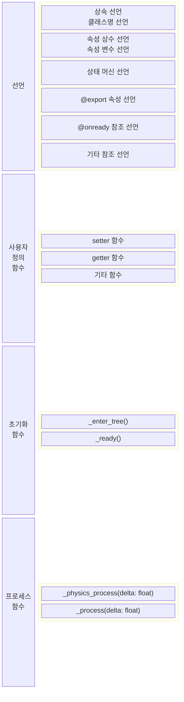

# CannonBall 문서
##  목차
- [게임 엔진](#게임-엔진)
- - [버전](#버전)
- - [설정](#버전)
- [씬 및 스크립트](#씬-및-스크립트)
- - [코어](#scene)
- - [오브젝트](#오브젝트)
- - [유틸](#유틸)
- - [싱글톤](#싱글톤) 
- [코딩 규칙](#코딩-규칙)
- - [스크립트 배치](#스크립트-배치)
- - [변수 선언](#변수-선언)
- - [함수 정의](#함수-정의)

****

## 게임 엔진
#### 버전
Godot 4.4.1 버전을 이용한다. [이 링크](https://godotengine.org/download/archive/)에서 다운로드할 수 있다. Godot 4.4.1 - stable 항목을 찾으면 된다.
압축 해제 후 Godot_v4.4.1-stable_win64.exe를 실행한다. 마지막에 _console이 추가로 붙어있는 프로그램은 사용하지 않는다.

#### 설정
중요한 설정들은 아래와 같다. 이 설정들은 개발 과정에서 변경될 수 있다.
**Project > ProjectSettings > General> Display > Window**
**> Size**
Viewport Width: 1920
Viewport Height: 1080
Resizeable: On
**> Stretch**
Mode: canvas_items
Aspect: keep
**Project > ProjectSettings > General > Rendering**
**> Renderer**
Rendering Method: forward_plus
**> Anti Aliasing**
MASS 2D: 2x
MSAA 3D: Disabled
Screen Space AA: Disabled
Use TAA: On 

****

## 씬 및 스크립트
씬은 게임 엔진의 에디터에서 실질적으로 존재하는 객체저럼 다룰 수 있으며 여러 속성을 쉽게 편집할 수 있다. 또한 에디터에서 트리 구조를 직접 배치할 수 있고, 이렇게 하면 부모 씬의 생성시 자동으로 생성된다.
스크립트는 보통 어떤 씬의 기능을 확장하기 위해 작성한다. 따라서 씬을 저장하면 쌍으로 스크립트도 함께 저장하는것이 일반적이다(.tscn - .gd). 다만 씬으로 존재할 필요가 없는 기능들, 예를 들면 겉으로 보여지지 않아 월드에 배치할 이유가 없는 순수한 백엔드 구현등이 있다.

씬과 스크립트는 기능의 특성에 따라 다음과 같이 분류하였다.
- 오브젝트(씬 + 스크립트)
- 유틸(씬 or 씬 + 스크립트)
- 싱글톤(스크립트)

#### 코어
게임에서 하나만 존재하면 되는, 핵심적인 중앙 기능이다. 트리 구조를 필요로 한다.
씬만 존재하거나, 씬과 스크립트가 함께 존재한다.
예: root, game

#### 오브젝트
유저가 직접 눈으로 보고, 월드에 끌어가 배치할 수 있는 실질적인 게임 내 물체이다.
씬만 존재하거나, 씬과 스크립트의 결합으로 존재한다.
예: player, cannon

#### 유틸
오브젝트는 아니지만 오브젝트와 함께 보조적인 기능을 함으로서, 한가지 오브젝트에 국한되지 않고 범용적인 부가 기능을 하기위해 설계된 컴포넌트이다.
스크립트만 존재하거나, 씬과 스크립트의 결합으로 존재한다.
예: camera_moving_controller, aim_controller, state_machine

#### 싱글톤
코어보다 더욱 광범위한 영역에서 필요한 중앙 기능으로, 게임에서 하나만 존재하되 트리 구조를 필요로 하지 않는다. 글로벌 인스턴스로서 게임 내 어떤 객체든 참조할 수 있어야 한다. 어느 씬의 자식으로 추가하지 않고 Project Settings > Globals 메뉴에서 자동 로드를 관리한다.
스크립트로만 존재한다.
예: multiplay_system, ui_manager

****

## 코딩 규칙
#### 스크립트 배치
게임 내 모든 스크립트는 다음과 같은 구조를 약속하여 작성한다.


#### 클래스 정의
- 새 스크립트를 만들때에는 항상 고유한 이름으로 클래스 이름을 짓도록 한다.
```gdscript
extends CharacterBody2D
class_name Player # 새롭게 지어준 클래스 이름
```

#### 변수 선언
- 변수를 선언할 때에는 항상 타입을 명시하도록 한다.
- 일반 속성 변수의 이름은 대소문자로 구성하고, 첫부분은 항상 소문자로 한다. 
```gdscript
var stateMachine: StateMachine
```
- 직접 이름을 지어준 클래스가 아닌, Godot에서 제공하는 기본 클래스(Node2D, CharacterBody2D 등)가 있다. 이에 대한 변수를 땐 클래스 이름을 소문자로 축약하여 앞에 붙인다. 단, '2D'는 생략한다.
```gdscript
var rcFloor: RayCast2D
var nCamTargetDefault: Node2D
``` 
- 상수의 이름은 대문자로만 구성하고 단어의 구분은 언더바로 한다.
- 상수는 반드시 초기화를 한다.
```gdscript
const WHEEL_RADIUS: float = 260.0
```
#### 함수 정의
- 함수의 이름은 소문자로만 구성하고 단어의 구분은 언더바로 한다.
- 매개변수을 선언할 땐 항상 그 타입을 명시하도록 한다.
- 반환타입 역시 항상 명시한다. 반환값이 없는 함수는 void로 명시한다.
```gdscript
func get_cur_velocity(delta: float) -> float:
```