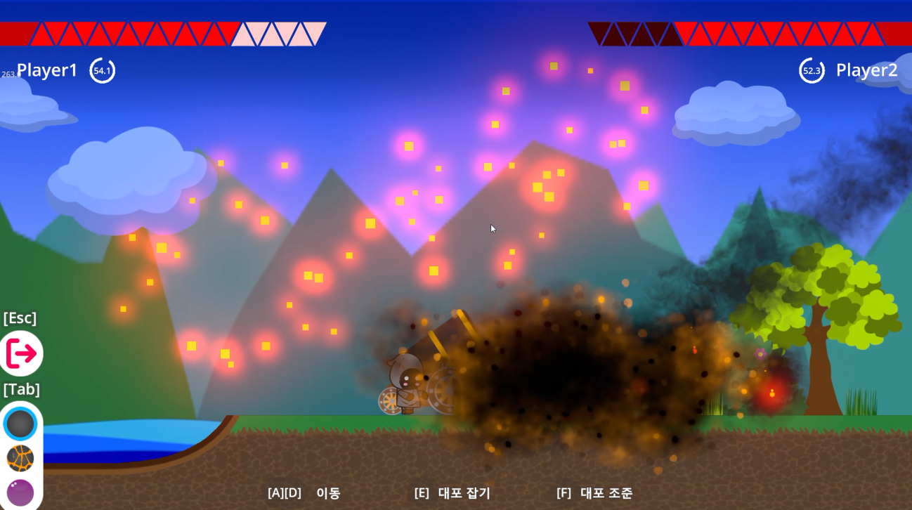

# CannonBall
##  목차
- [개요](#개요)

****
## 개요

게임 소개: 대포와 세 종류의 탄환을 이용하여 전투를 벌이는 2D 턴제 슈팅 게임
팀 소개: 연성대학교 컴퓨터 소프트웨어과 '본때' 동아리 소속 5인
팀 구성: 팀장 1, 프로그래밍 2, 그래픽 및 UI 2
개발 환경: Windows11, [Godot Engine 4.4.1](https://godotengine.org)
개발 언어: GDScript, glsl3.0(쉐이더)
버전 관리: Github
기타 사용 툴: Adobe Illustrator(에셋 제작)

****

## 테스트 방법

#### 스팀 멀티플레이 테스트
1. 스팀 클리아이언트 실행 및 로그인
2. **CannonBall/CannonBallExe/CannonBall.exe** 실행
3. 호스트: 'Steam 친구 초대' 버튼 클릭 -> 함께 테스트하는 사람 스팀 친구 선택 -> '호스트' 버튼 클릭(게임이 로드되고 초대가 전송됨)
4. 참가자: 초대를 받으면 '초대 수락' 버튼 활성화 -> 클릭
#### 한 대의 컴퓨터에서 테스트
1. **CannonBall/CannonBallExe/CannonBall.exe** 두번 실행
2. 한 쪽 게임에서 '로컬 게임 생성' 버튼 클릭 
3. 다른 쪽에서 '로컬 게임 참가' 버튼 클릭